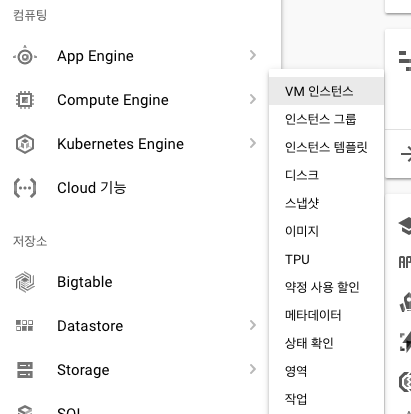

# 구글 클라우드 플랫폼(GCP) 에 우분투 올리기

https://cloud.google.com/?hl=ko


# 조건
```
구글 계정 만들기

예) anemo.mark@gmail.com 으로 신규계정 발급

```
1. [구글 클라우드 접속](https://cloud.google.com/?hl=ko)

2. 무료로 사용해 보기 클릭


3. 약관 동의


4. 주소 및 카드 정보 입력


5. 계정 생성 완료


6. My First Project 클릭


7. 새로운 프로젝트 추가 (+ 클릭)


8. 프로젝트 추가


9. 추가된 프로젝트 선택


10. 결제에서 크레딧 및 무료 사용 가능 일자 확인


11. Cumpute Engine > VM 인스턴스 클릭



12. 인스턴스 만들기


13. CPU , 메모리 설정


14. 이미지 선택


15. 용량 선택


16. 인스턴스 생성 완료 (브라우저 창에서 열기 : 웹상에서 콘솔 접속)


17. 웹 콘솔 접속


