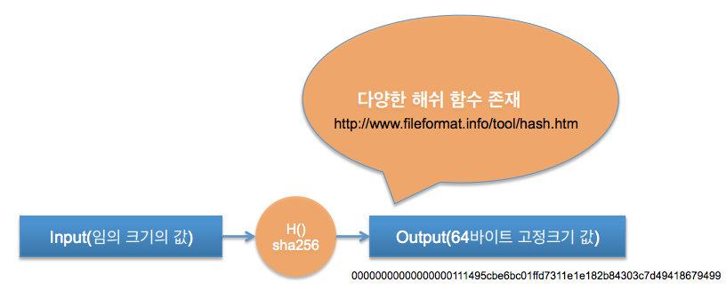
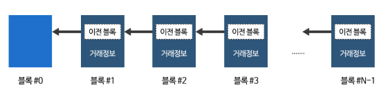
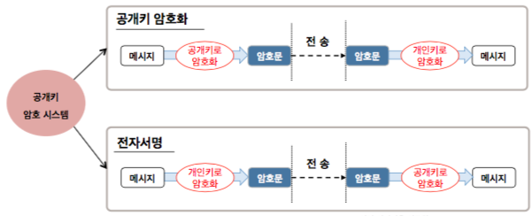
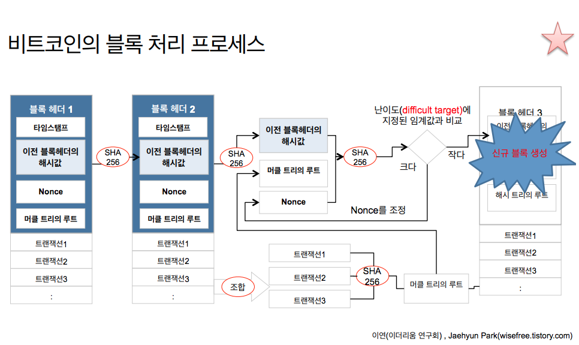
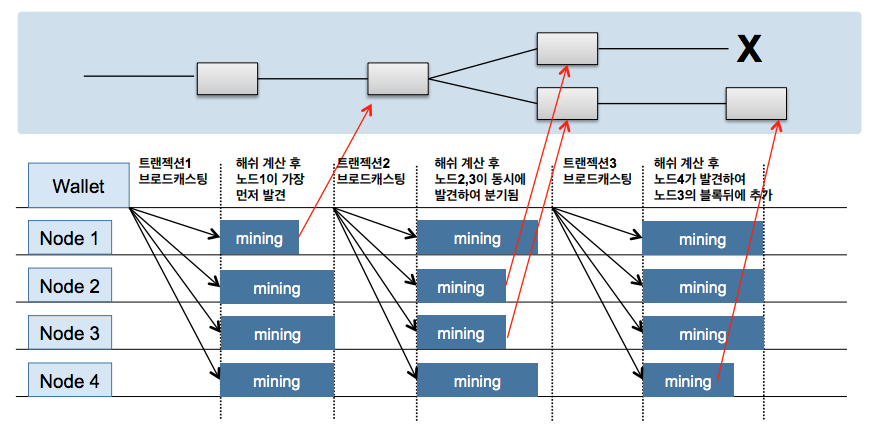
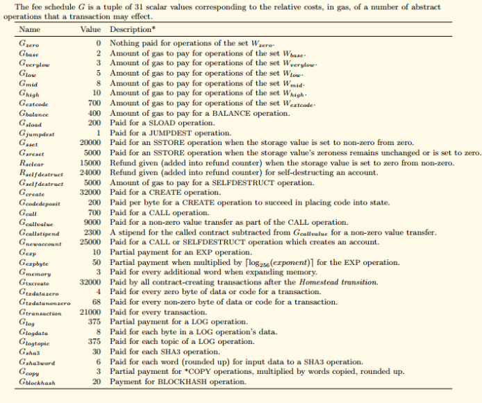
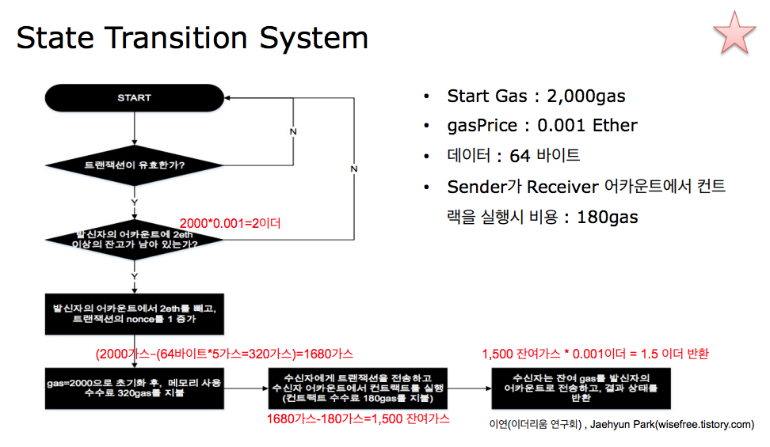

# 1세대 블록체인 (비트코인)

## 0. 해시란?

## 1. 시스템 구조

    제니시스 블록 -> 블록1 -> 블록2 -> ... -> 블록N -> ...

## 2. 블록 구조

    헤더
    - 이전블록 해시
    - 현재블록 해시
    - 마이너 정보
    - 트랜잭션 요약 해시 (머클트리)
    - 난이도
    - 높이
    - 타임 스탬프
    - 난스
    - 보상 및 수수료
    - 크기
    - [가스 리미트]
    - [가스 사용량]
    
    바디
    - 트랜잭션
    - [엉클 블록]

## 3. 계정 (지갑, 주소)

    보상(코인)을 담는 곳
    공개키 암호 시스템 이용하여 소유자 구별

## 3. 트랜잭션

    거래

## 4. 마이닝 (블록 생성)

    시스템에 지정된 난이도(해쉬 목표값) 보다 작은 해당블록 해쉬값이 나왔을 경우
    블록으로 인정됨.(+ 지정된 시간 이내)
    원하는 해쉬값이 나올 때까지 난스를 올린다.(+타임스탬프도 변경요소)

## 5. 합의 매커니즘

    다수의 마이너가 블럭 생성한다면 누구의 블럭을 인정해 주어야 하나?

## 6. 정리

    - 특정 노드에서 트랜잭션 발생
    - 해당 노드의 트랜잭션 풀(메모리)에 추가
    - P2P 로 연결된 노드들에게 트랜잭션 전파 (전파 받은 노드는 트랜잭션 발생으로 간주)
    - 트랜잭션 풀 안에 있는 트랜잭션 중에서 보상이 좋은 순서 위주로 임시 블럭을 구성
    - 임시 블럭을 최종 블럭으로 만들기 위해 난이도보다 낮은 해쉬값이 나올때까지 임시 블럭을 해쉬함
    - 최종 블럭이 생성되면 합의 매커니즘을 통해 인증 블럭 또는 스테일 블럭(엉클 블럭)으로 분류됨
    - 인증 블럭이 되면 마이너에게 보상을 줌 (이더리움은 엉클블록도 보상해줌)

# 2세대 블록 체인 (이더리움)

## 1. 개념

    - 트랜잭션 장부를 넘어서 플랫폼을 지향

    - 데이터베이스(트랜잭션) + 컴퓨팅(스마트컨트랙트) + 메세징(캐스퍼) + 스토리지(스웜)

## 2. 비트코인과 차이

    - 계정 (Externally Owned Accounts, Contrats Accounts)
    - 수수료 (Gas)

## 3. 스마트 컨트랙트

    - 트랜잭션에 저장된 값A을 트랜잭션에 저장된 코드를 사용하여 계산한 뒤,
      새로운 트랜잭션을 생성하여 저장된 값A을 덮어쓴다.
      (체인형태로 덮어씀, 마지막 값이 현재의 값)
    - 

## 3. 가스

    서비스 이용 포인트
    이더리움이 돈 이라면, 가스는 포인트
    포인트는 1개당 얼마에 사겠다는 것은 본인이 결정
    단순 송금 시 21,000 가스 필요

## 4. 이더리움 트랜잭션

    From : EOA 주소
    To : EOA 또는 CA 주소
    Value : 보낼 이더리움
    Timestamp : 생성 시간
    Gas Limit : 최대 사용할 가스량
    Gas Price : 가스 1당 가격
    Nonce : 이 계정에서 이제까지 생성한 트랜잭션 수
    Input Data : 컨트랙트 실행에 입력할 데이터

    트랜잭션 생성 시 최대 얼마까지 가스를 쓸건지, 가스 1당 가격을 얼마로 할 것인지 본인이 정함.
    마이닝 중 가스를 초과하면 트랜잭션은 블럭에 들어갈 수 없고, 가스는 날아감.

## 5. 이더리움 합의 알고리즘

## 6. 엉클 블럭

    블록생성에 성공하였고 검증에 오류가 없어서 네트워크를 통해 전파되었으나,
    더 빨리 전파된 다른 채굴자들 에 의해 순위가 밀려 주체인에 들어가지 못한 블록

## 7. 현재

    Ethash (POW) : 약 12초 마다 하나씩 블럭 생성

## 7. 미래

    POS
    스웜
    캐스퍼

## 8. 참고

    http://swarm-gateways.net/bzz:/swarm-gateways.eth/
    https://etherscan.io